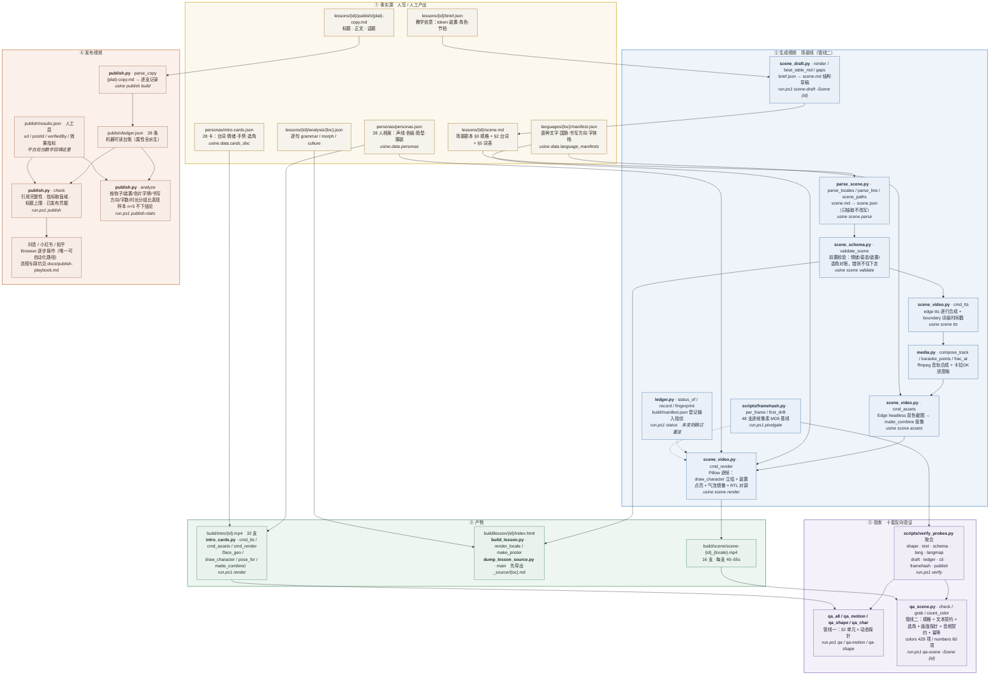

# une usine avec des machines rugissantes

> 「一座轰鸣着机器的工厂」——**人物是数据（personas），课程是数据（lessons），不是代码。**

用 edge-tts 配音 + Edge headless 渲文字层 + Pillow 逐帧绘制 + ffmpeg 合成，
批量产出 **14 语种 × 男女 = 28 位**教学视频人物「班底」与她们的课程短片。

| 产出 | 数量 | 规格 | 位置 |
|---|---|---|---|
| 人物亮相卡 | **32 支** | 1080×1920 @ 30fps，h264+aac，10s | `build/intro/{id}.mp4` |
| A/B 对话教学场景 | **16 支** | 每支 40–55s，14 语种 + 2 语种示范课 | `build/scene/scene-{id}_{locale}.mp4` |
| 教学文档 | 1 份/课 | 单文件 HTML，14 语种逐句解析 + 内嵌视频 | `build/lesson/{id}/index.html` |

> 32 = 28 张主卡 + 4 个 RTL 语种的「女性观众版」（`{id}_f.mp4`，独立缓存键）。
> 16 = colors 课 14 语种 + numbers 课 2 语种。
> 合计 **48 支成片**，全部受 `.\run.ps1 pixelgate` 逐帧像素基线保护。

---

## 目录

| 章节 | 给谁看 |
|---|---|
| [1. 5 分钟跑通](#1-5-分钟跑通) | 第一次来，先跑出一条成片 |
| [2. 流水线全景图](#2-流水线全景图生成--发布) | 想搞清数据怎么流到成片和平台 |
| [3. 我要做 X](#3-我要做-x) | 日常干活：改什么、跑什么、怎么验收 |
| [4. 验收契约](#4-验收契约改什么必须跑什么) | 提交前自检 |
| [5. 命令参考](#5-命令参考) | 查 `run.ps1` 的全部 phase |
| [6. 仓库地图](#6-仓库地图) | 找文件 |
| [7. 深入](#7-深入) | 设计原则 / 班底 / 全部改法索引 |

---

## 1. 5 分钟跑通

**前置**：Windows PowerShell 5.1、已装 `uv`、已装 ffmpeg 与 Edge（`msedge.exe`）。
`.venv` 缺失不用管，`run.ps1` 会自动 `uv sync`。

```powershell
cd D:\coding\personal\explorateur

# ① 看看现在有什么（不渲、不改任何东西）
.\run.ps1 status              # 缓存账本：48 支产物哪些过期了、因为什么
.\run.ps1 scene-list -Scene colors   # 列出场景：台词行数 / 时长 / 选角 / 装置

# ② 渲染管线一：28 位人物的亮相卡（约 5 分钟，产出 32 支）
.\run.ps1 all

# ③ 渲染管线二：一门课的 14 语种教学短片（约 20 分钟，产出 14 支）
.\run.ps1 scene -Scene colors

# ④ 验收
.\run.ps1 qa                  # 管线一 32/32
.\run.ps1 qa-scene -Scene colors   # 管线二 429 项
.\run.ps1 pixelgate            # 48 支逐帧像素比对（约 2 分钟）
```

**只想看成品**：直接打开 `build/intro/xiaoman.mp4` 和
`build/lesson/colors/index.html`——它们已经在仓库的构建产物里，不必先跑任何命令。

**只想改一门课**：见 [§3.1 新增课程](#31-新增课程-零代码接入)，整条路是 4 步。

---

## 2. 流水线全景图（生成 + 发布）

每个节点都标了**文件 · 方法**。括号里是 PowerShell 里的调用方式。



**图的读法**：实线是数据流，虚线是「跳过重渲」的控制流。**生成线只有一个入口是代码**——
`parse_scene` 与 `scene_video` 都是场景无关的；换主题、换 chip 类型、换装置、换语种子集
都只改 `brief.json` / `scene.md`，`git diff src/` 保持为空（`lessons/numbers` 是活证据）。

**发布线不可自动化的是最后一步**。抖音/小红书/知乎的后台必须用 Browser 逐步操作，
踩坑与逐支序列见 [publish-playbook.md](docs/publish-playbook.md)（23 条坑）与
[zhihu-publish-playbook.md](docs/zhihu-publish-playbook.md)（20 条坑）。
**但发布之前的所有准备——文案、台账、凭据、指标——都是机器管的**，且有门禁。

---

## 3. 我要做 X

### 3.1 新增课程（零代码接入）

四步，**不改一行 Python**：

```powershell
# ① 写教学创意：token（色片 #hex 或字牌 "文本"）/ 装置 / 角色 / 骨架行数 / 每节说话人与情绪
#    → lessons/{id}/brief.json
# ② 生成结构草稿（只填结构，台词留 TODO）
.\run.ps1 scene-draft -Scene {id}
# ③ 填掉所有 TODO（--gaps 看还欠多少）
uv run python -m usine.scene_draft --brief lessons/{id}/brief.json --gaps
# ④ 走全链路
.\run.ps1 scene -Scene {id} && .\run.ps1 qa-scene -Scene {id}
```

> `scene-draft` **默认拒覆盖**已有的 `scene.md`（除非它带 `draft: true` 标记）。
> 一个叫「生成草稿」的 phase 如果默认带 `--force`，就能把已验收的课整个抹掉——
> 2026-10-04 就这么出过事。真要重写请显式 `--force`。

### 3.2 加一门课的教学文档

```powershell
.\run.ps1 dump-lesson -Scene {id}          # scene.json → analysis/_source/{loc}.md（可读源文本）
#   → 人工产出 analysis/{loc}.json（逐句 grammar/morph/culture）
.\run.ps1 lesson -Scene {id}               # 合并成 build/lesson/{id}/index.html
```

### 3.3 加一个语种

```powershell
# ① 新建目录 languages/{loc}/manifest.json：locale / label / flag / dir / fontCss / quote
# ② 写在该课的 scene.md §0 的 rtlLocales（若为 RTL）
.\run.ps1 langs          # 门禁：字段齐备 / 国旗必须是该 locale 的 ISO 区码 / 字体栈带兜底
```

> **国旗必须等于 locale 的 ISO 区码**（`zh-CN` → 🇨🇳）。Windows Segoe UI Emoji 无国旗字形时
> 渲染为 ISO 双字母对——**错旗比字母对更糟**，所以错旗判死，不降级为提示。

### 3.4 改一个人的形象

改 `personas/personas.json` → `.\run.ps1 qa-char` 对照色板 → `.\run.ps1 all`。
头身比例/五官位置只改 `face_geo()` 比率表，**发型/配饰/探针全部按比例自动跟随**。

### 3.5 发一支新视频

```powershell
# ① 文案写进 lessons/{id}/publish/{plat}-copy.md
# ② 重建台账 + 过门禁
uv run usine-publish build && .\run.ps1 publish
# ③ 按 docs/publish-playbook.md 逐步发布
# ④ 把平台后台数字回填到 publish/results.json（没数据留 null，别填 0）
#    然后看结论
.\run.ps1 publish-stats
```

### 3.6 改任何东西之后

见 [§4 验收契约](#4-验收契约改什么必须跑什么)。

---

## 4. 验收契约（改什么必须跑什么）

| 你改了什么 | 至少要跑 | 不跑会怎样 |
|---|---|---|
| 任何渲染代码（`intro_cards` / `scene_video` / `media`） | `run.ps1 pixelgate` | 画面静默变了，没有任何东西会报错 |
| 任何验收探针（`qa_*`） | `run.ps1 verify` | 探针恒真，「全绿」是假绿灯 |
| `scene.md`（某门课） | `run.ps1 scene -Scene {id}` + `qa-scene -Scene {id}` | 成片与剧本脱节 |
| `brief.json` / 新课 | `run.ps1 scene-draft` + `scene` + `qa-scene` | 同上 |
| `personas.json` / `intro-cards.json` | `run.ps1 all`（含 qa/qa-motion） | 色板/画幅/口型不变量被破坏 |
| `languages/*/manifest.json` | `run.ps1 langs` | 渲出没旗的旗牌，且**不报错** |
| 发布文案 / `results.json` | `run.ps1 publish` | 引用完整性失效（视频已不在磁盘上） |
| `pyproject.toml` / `cli.py` | `run.ps1 verify`（含 cli 套） | 旧入口的子命令静默消失 |
| 依赖版本（尤其 Pillow） | `run.ps1 pixelgate` | **像素基线失效**，全部对比失去意义 |

**三条不可协商的纪律**：

1. **零像素漂移**是硬判据。`pixelgate` 用 `ffmpeg -v error -i X -map 0:v -f hash -hash md5 -`
   算解码后逐帧像素的 MD5。`-map 0:v` 是承重的——少了它 ffmpeg 走默认流选择，
   数字会不同且**不报任何错**。容器的字节哈希不作数（mux 参数一变就全红，与画面无关）。
2. **账本说 fresh ≠ 画面对**。`run.ps1 status` 只回答「没理由重渲」，正确性判据永远是 `pixelgate`。
3. **加了新门禁就要做反向验证**：拿已知坏数据证明它 FAIL，再拿好数据证明它放行。
   第一条断言**必须是「好数据放行」**——坏数据只能证明「能抓到坏」，证明不了「没把好的也一起抓了」。

```powershell
uv run python scripts/framehash.py --locate        # 漂移定位到帧（第 N 帧 / t=秒）+ 抽证据图
uv run python scripts/framehash.py --save-frames build/baseline/frames   # 采集逐帧基线
uv run python scripts/verify_probes.py --only publish                   # 只跑某一套
```

---

## 5. 命令参考

统一入口 [`run.ps1`](run.ps1)。`usine <组> <命令>` 是等价的 Python 侧入口
（路由表 `cli.COMMANDS` 是数据不是 if/elif；8 个旧 `usine-*` 入口**一个都没删**）。

| 管线 | phase | 做什么 |
|---|---|---|
| **人物亮相卡** | `all` | tts → assets → render → qa → qa-motion → verify |
| | `tts` / `assets` / `render` | 逐阶段（`-Only xiaoman,layla` 限范围，`-Workers 7` 并发） |
| | `qa` / `qa-motion` / `qa-shape` / `qa-annotate` / `qa-shape-verify` | 验收四件套 + 缺陷框标注图 |
| | `chars` | 人物形象体检台（28 人立绘大图） |
| **教学场景** | `scene -Scene <id>` | parse → tts → assets → render |
| | `scene-tts` / `scene-assets` / `scene-render` | 逐阶段 |
| | `scene-draft -Scene <id>` | brief.json → scene.md 结构草稿 |
| | `scene-list` / `qa-scene` | 列场景 / 场景线验收 |
| **教学文档** | `dump-lesson -Scene <id>` | scene.json → analysis/_source/ |
| | `lesson -Scene <id>` | scene.json + analysis → build/lesson/<id>/index.html |
| **门禁** | `verify` | 十套反向验证 |
| | `langs` | 语种目录门禁 |
| | `publish` | 发布台账门禁 |
| | `publish-stats` | 平台指标回流分析 |
| | `status` | 缓存账本：谁过期了、为什么 |
| | `pixelgate` | 48 支逐帧像素比对 |

> `-Only a,b` 这类逗号列表在 PowerShell 里**必须加引号**，否则被解析成数组传给 `[string]` 参数直接报错。

---

## 6. 仓库地图

### 事实源（改这些 = 改产品）

| 文件 | 职责 |
|---|---|
| `personas/personas.json` | 28 人档案——声线/色板/脸型/发型/服装/配饰 + 档案四字段（人设唯一事实源） |
| `personas/intro-cards.json` | 28 张卡——台词/情绪/手势/入场姿态/场景/收尾码/A·B 选角；RTL 卡带 `variants[]` |
| [`languages/{loc}/manifest.json`](languages/README.md) | **语种目录**——语种文字/国旗/书写方向/字体栈的唯一事实源，一个语种一个目录 |
| `lessons/{id}/brief.json` | 教学创意（token/装置/角色/骨架节拍），`scene_draft` 的输入 |
| `lessons/{id}/scene.md` | **场景剧本唯一事实源**——§0 机读规格 + §2 各语种台词 + §5 token 词表。不设母本、不互译 |
| `lessons/{id}/analysis/{loc}.json` | 逐句 `{grammar, morph, culture}` + 家族/书写/舞台三段（人工产出） |
| `lessons/{id}/publish/{plat}-copy.md` | **发布文案唯一事实源**——双平台各一份 |
| `publish/results.json` | 人工层：平台 url / 凭据 / 效果指标（**没数据留 null，别填 0**） |
| `publish/ledger.json` | 机器可读发布台账（`usine publish build` 派生，属性全派生不手抄） |

### 代码（`src/usine/`）

| 文件 | 职责 |
|---|---|
| [`data.py`](src/usine/data.py) | **数据入口唯一事实源**——`personas()` / `cards_doc()` / `scene_doc()` / `unit_persona()` / `fonts_css()` / `flags()` / `lang_label()`，进程内只读缓存 |
| [`media.py`](src/usine/media.py) | **媒体内核**——`compose_track`（ffmpeg 音轨）/ `karaoke_points`+`frac_at`（卡拉OK轴）/ `edge_window_h`（视口探针），两条管线共用一份 |
| [`scene_schema.py`](src/usine/scene_schema.py) | **场景数据前置校验** `validate_scene`——卡在 parse 与 render 之间，判定依据全取自既有注册表，零硬编码 |
| [`intro_cards.py`](src/usine/intro_cards.py) | 管线一本体（`cmd_tts`/`cmd_assets`/`cmd_render`）+ 人物 rig（`face_geo`/`draw_character`/`pose_for`）与场景原语注册表 |
| [`parse_scene.py`](src/usine/parse_scene.py) | 通用场景解析器 `parse_locales`/`parse_line`：`scene.md` → `scene.json`（只抽取不改写，场景无关） |
| [`scene_video.py`](src/usine/scene_video.py) | 管线二 `cmd_tts`/`cmd_assets`/`cmd_render`/`cmd_list`：选角/双人站位/token 装置/气泡/RTL 镜像（场景无关） |
| [`scene_draft.py`](src/usine/scene_draft.py) | 内容前置 `render`/`beat_table_md`/`gaps`：brief.json → scene.md 结构草稿（填结构不填内容） |
| [`ledger.py`](src/usine/ledger.py) | 缓存账本 `status_of`/`record`/`fingerprint`——`build/manifest.json` |
| [`cli.py`](src/usine/cli.py) | 统一 CLI 路由表 `COMMANDS` + 旧入口等价表 `LEGACY_EQUIV` |
| [`publish.py`](src/usine/publish.py) | 发布台账 `build`/`check`/`analyze` + `parse_copy` |
| `qa_all/qa_motion/qa_shape/qa_char/qa_grid` | 管线一验收五件套 |
| [`qa_scene.py`](src/usine/qa_scene.py) | 管线二验收（`check`/`grab`/`count_color` 等探针） |
| [`build_lesson.py`](src/usine/build_lesson.py) | scene.json + analysis → 教学文档 HTML（`render_locale`/`make_poster`） |
| [`dump_lesson_source.py`](src/usine/dump_lesson_source.py) | scene.json → analysis/_source/{loc}.md（只排版不改写） |
| `char_sheet.py` | 人物形象体检台：立绘大图 / 总览 / 索引页 |

### 验收（`scripts/`）

`verify_probes.py` 聚合**十套反向验证**（`.\run.ps1 verify`）：
`verify_shape_fixes` / `verify_text_contract` / `verify_scene_schema` / `verify_languages` /
`verify_lang_migration` / `verify_scene_draft` / `verify_ledger` / `verify_cli` /
`framehash` / `verify_publish`。
发布侧另有 `create_douyin_collection` / `promote_douyin_collection` / `publish_douyin`
（Playwright，`uv sync --group douyin` 按需装依赖）与 `build_zhihu` / `verify_zhihu_lossless`。

### 文档

| 文件 | 内容 |
|---|---|
| [`docs/render-handbook.md`](docs/render-handbook.md) | **工程手册——改任何东西前先读**。§3 参数地图 · §5 踩坑实录（坑①–㉴）· §6 调优手册（§6.8–6.12 含新课流程/缓存账本/统一 CLI/视觉基线/发布回流） |
| [`docs/requirement.md`](docs/requirement.md) | 原始规格：界面三区布局 + 人物四轴 |
| [`docs/plan.md`](docs/plan.md) | 总规划：28 人班底、persona schema、选角规则、幂等保障 |
| [`docs/self-introductions.md`](docs/self-introductions.md) | 内容种子——每卡台词/注音/对照/分镜/验收清单 |
| [`docs/adr-character-tech.md`](docs/adr-character-tech.md) | 技术选型裁定：Pillow 续役，H3+Remotion 迁移案为备选蓝图 |
| [`docs/benchmark-duolingo.md`](docs/benchmark-duolingo.md) | 对标台账——多邻国三文档逐条裁定 |
| [`docs/publish-playbook.md`](docs/publish-playbook.md) | 多平台发布手册——抖音/小红书流程、差异对照、23 条踩坑、核验清单 |
| [`docs/zhihu-publish-playbook.md`](docs/zhihu-publish-playbook.md) | 知乎发布手册——Markdown 导入（唯一可自动化路径）、20 条踩坑、15 篇台账 |
| [`languages/README.md`](languages/README.md) | 语种目录体例：五个字段的约束 + 为什么国旗必须等于 ISO 区码 |

### 环境

`pyproject.toml` / `uv.lock` / `.venv`——uv 工程（src 布局），`uv run` 按锁文件自动同步。
依赖精确锁版：`edge-tts==7.2.8` / `pillow==12.3.0` / `numpy==2.3.5`。
**Pillow 12.3.0 是像素基线**，升级前必须重验 framehash。
`.gitignore` 忽略 `build/`（全部产物不入库）。

---

## 7. 深入

### 7.1 设计原则

浓缩自 [plan.md](docs/plan.md) §4/§7 与手册的不变量：

- **人设是数据不是代码**：`personas.json` 驱动整个绘制 rig（`face_geo()` 六型脸是几何唯一事实源，
  脸型/服装/配饰全走数据槽）；场景里永不写死 RGB、嘴形、眨眼节奏。
- **课程是数据不是代码**：教学 token、RTL 语种、舞台装置全在 `scene.md` §0 机读规格里；
  新课 = 新建目录照抄体例，解析器与渲染线零改动。
- **词级时间戳一轴三用**：口型开合、卡拉OK逐词高亮、手势触发共用同一时间轴，换台词自动重对齐。
- **动作排他是人设数据**：剧本只写槽位语义（point/wave…），每人 `moves` 槽位表映射成专属姿态码。
- **场景文字带三层堆叠**：原文（自适应缩排）→ 中文对照 → ⚑ 文化/语言注记（更小一号、金色）。
- **画面不靠色**：舞台背板带把人物区渐变底压暗 26%；文字带各层、立绘与背景的对比
  全部有 `qa_scene` 数值探针。
- **幂等是硬约束**：一切随机性播种（`rnd(seed:...)`）；同输入 → 逐帧同输出。
- **人物无描边**（多邻国式纯平涂）；场景道具描边只用 `pal["ink"]` 柔色。
- **情绪与手势是数据不是发挥**：共享情绪增量表 + 行级基线，合成出声线与表情参数。
- **不替所有课定规则**：`noteFloor`（注记下限）、`askBalance`（问答对称性）由**每门课自己的 §0 声明**，
  通用探针只验「声明了就要做到」，不设一个全局默认数。

### 7.2 班底一览

14 语种 × 男女 = 28 位 persona。每语种一对「活泼 × 稳重」搭档——
自然的对话张力，同语种内的声学多样性。脸型/发型/着装/配饰按人设逐人差异化。

| 语种 | 女声 | 男声 | 语种 | 女声 | 男声 |
|---|---|---|---|---|---|
| zh-CN | 林小满 | 江远 | ja-JP | ハルカ | リク |
| en-US | Ruby | Miles | ko-KR | 서연 | 도윤 |
| fr-FR | Chloé | Théo | it-IT | Giulia | Luca |
| de-DE | Lena | Felix | he-IL | נועה | יובל |
| es-ES | Lucía | Mateo | zh-HK | 阿晴 | 阿豪 |
| ru-RU | Аня | Миша | hi-IN | प्रिया | अर्जुन |
| el-GR | Ελένη | Νίκος | ar-SA | ليلى | عمر |

完整档案（声线、色板、脸型、着装、招牌动作、配饰、人物关系）见 [plan.md](docs/plan.md) §5。

### 7.3 想改什么 → 去哪改（全量索引）

| 想改 | 改这里 | 跑什么 |
|---|---|---|
| 台词 / 注音 / 中文对照 | `self-introductions.md` + `intro-cards.json` `lines[].text`（**两处同步**） | `tts`，看 speech_end ≤ 8.5s |
| 情绪 / 手势触发 | 行级 `lines[].mood`；卡级 `gestures[]`（手势词必须真实出现在台词里） | `all` |
| 收尾招牌动作 | `intro-cards.json` `close`（码见 `pose_for`） | `all` |
| 人设（声线/色板/脸型/发型/服装/配饰） | `personas.json`（脸型走 `FACE_SPECS` 六型；服装走 `outfit` 槽） | `qa-char` → `all` |
| 人物档案四字段 | `personas.json` 的 `gloss`/`timbre`/`relation`/`quirk`（**不进渲染**） | — |
| 头身比例 / 五官位置 | 只改 `face_geo()` 比率表（其余自动跟随） | `qa-shape` → `all` |
| 场景背景 | `intro_cards.py` 的 `@scene(...)` 原语注册表 + 卡级 `scene[]` | `all` |
| 名牌 / 语言牌 / 气泡样式 | `badge_html` / `pill_html` / `bubble_html` | `all` |
| **语种**（字体/国旗/语种文字/书写方向） | `languages/{loc}/manifest.json`——**新增语种 = 新建目录** | `langs` |
| **新增课程** | `lessons/{id}/brief.json` → `scene-draft` → 填 TODO → `scene` | `qa-scene` |
| 换教学形态（独白/小测…） | §0 的 `form:` + §0.5 节拍表——**不改 Python**（`form` 必须在 `scene_schema.FORMS` 注册，未实现的会被前置校验拦下） | `qa-scene` |
| 场景台词 / 情绪 / 手势 / 舞台 | `lessons/{id}/scene.md` §2（解析器只抽取不改写） | `scene` + `qa-scene` |
| 场景 token / RTL / 装置规格 | `lessons/{id}/scene.md` **§0**（井位/井形/空井色全在数据里） | `scene` + `qa-scene` |
| 注记行数下限 | §0 `noteFloor`（缺省 0 = 不要求）——**下限由该课自己声明** | `qa-scene` |
| 问答对称与否 | §0 `askBalance`（`symmetric` / 缺省 `any`） | `qa-scene` |
| 逐句语法/词法/文化解析 | `lessons/{id}/analysis/{loc}.json` | `lesson` |
| **发布文案 / 平台效果** | `{plat}-copy.md` → `usine publish build`；指标回填 `publish/results.json` | `publish` / `publish-stats` |
| 知乎专栏正文 / 目录链接 | `scripts/build_zhihu.py` 的 `PUBLISHED_URLS` 表（15 篇真实 URL 的单一事实源） | `verify_zhihu_lossless.py` |
| 人物生成技术路线 | 见 [adr-character-tech.md](docs/adr-character-tech.md)（现役 Pillow；动 `draw_character` 前先读） | — |

---

## 已知缺陷

诚实记录，**不藏在文档深处**：

| 编号 | 问题 | 状态 |
|---|---|---|
| 抖音 01 | 正文被联想面板污染：重复整段 + 错话题 `#小语种就业前景`，242 字（应为 124 字） | ⬜ 待修 |
| 抖音 09 / 10 | 正文「从红色一路**查**到白色」应为「**问**到」 | ⬜ 待修 |
| 小红书草稿箱 | 残留 1 条：05 意大利语首次上传被页面重载打断、存成草稿（内容与已发布的 05 重复） | ⬜ 待删 |
| 知乎 | 服务端会过滤整个阿拉伯文区段 U+0600–U+06FF（导入完好、存盘消失，无法绕过） | ⚠️ 平台限制，已在文中挂说明 |
| 平台指标 | 抖音/小红书/知乎的后台数字**尚未回填** `publish/results.json`，`run.ps1 publish-stats` 目前如实报「无数据」 | ⬜ 待回填 |
