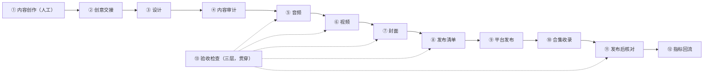

# 工作流



**三大产物**（依赖顺序：音频 → 视频 → 封面）：

| 产物 | 生成段 | 位置 |
|---|---|---|
| 音频 | ⑤ | `build/audio/`（逐行 mp3 + 词级时间戳、人声轨） |
| 视频 | ⑥ | `build/video/{名}_{宽}x{高}.mp4`（横竖两画幅） |
| 封面 | ⑦ | `build/covers/{语种}_{变体}_{宽}x{高}.png`（四平台变体） |

## ① 内容创作（人工）

| | |
|---|---|
| 输入 | 主题 / 意象 / 平台策略 |
| 步骤 | **人写**：故事与结构、各语种正文（各用其正格、独立创作禁止互译）、体式声明、注记 |
| 产物 | 创意包（文稿；本工程之外） |
| 检查 | 体式声明要么可审计、要么主动不标；事实分级（词典级 / 口语级 / 假说级）；不确定的宁可不写 |

## ② 创意交接

| | |
|---|---|
| 输入 | ① 创意包 |
| 步骤 | 机器可读化入 `data/`：正文 `text[]`、注记 `note`、选角槽位、时间轴参数；片名 / 首句 / 体式标签**只写这一处** |
| 产物 | `data/` 数据（下游一切文字的唯一来源） |
| 检查 | schema 纯函数校验必须通过；中译与正文行数一致；需要 H3 母版时在此提出申请——**逐次确认额度，未确认不生成** |

## ③ 设计

| | |
|---|---|
| 输入 | ① 创意包 + ② data |
| 步骤 | 见下表七项，全部落成机器可读参数 |
| 产物 | 台词 / 选角 / 节拍 / 场景 / 时间轴 / 版式 / 分镜配置 |
| 检查 | 设计只改数据不改编码；画幅档位与画面基底**成对绑定** |

| 设计项 | 做什么 | 落点（机器可读） |
|---|---|---|
| 台词设计 | 多语种朗读文本、行数、注音、双语字幕与注记 | `text[]` / 注记字段 |
| 人物选择 | 选角：音色（voiceId）、语速 / 音高偏移、人设——班底库直取或新建 | 选角字段（指回声库来源） |
| 故事设计 | 叙事结构、节拍、时长预算 | 节拍表 / durationBudget |
| 场景设计 | 舞台、背景、装置 | 场景配置 |
| 转场设计 | 段落切换、镜头衔接、朗读窗口与行距 | 时间轴参数（窗口起点 / line_gap） |
| 画面布局 | 字幕带 / 卡片位置、文字安全区、画幅几何 | 版式参数（画幅档位型） |
| 分镜设计 | 镜序、时码、机位、构图、声音 / 色调规格；（如用 H3）→ 时码化提示词 | storyboard + prompt |

## ④ 内容审计

| | |
|---|---|
| 输入 | ② 正文与体式声明（③ 改稿后重跑） |
| 步骤 | 逐语种实测：手写拆分供人眼复核 + 算法交叉验证，不一致以算法为准并报警 |
| 产物 | 审计报告（三态：✅ 通过 / ○ 不作声称 / 待处理） |
| 检查 | 声明与实测不符 → 改正文或撤声明；验证不了的声明撤下（不作声称是合法状态） |

## ⑤ 音频（产物 1）

| | |
|---|---|
| 输入 | ② 正文 + 选角 |
| 步骤 | 合成（缓存键 `sha256(voiceId\|rate\|pitch\|text)[:16]`，miss 才请求）→ 词级时间戳（`boundary="WordBoundary"`）→ 时间轴补齐（`speech_dur` / `file_dur` 按 ffprobe 实测 / `tail_silence` / `start` 累进） |
| 产物 | **音频**：`build/audio/{key}.mp3 + .json`、tts-manifest、人声轨 |
| 检查 | 时长预算卡在这一步（改文本便宜）；超预算放宽预算、不压台词；`NoAudioReceived` 退避重试 |

## ⑥ 视频（产物 2）

| | |
|---|---|
| 输入 | ⑤ 人声轨 + ② 文字 + ③ 版式 + 画面基底（H3 母版——逐次确认额度、一次按画幅成对、生成后冻结；或程序化逐帧渲染） |
| 步骤 | 文字层 HTML → Edge headless 截图（不透明整图单截；透明叠加层白/黑双 matte）→ ffmpeg 叠加基底 + `compose_track` 混音 → loudnorm −14 LUFS |
| 产物 | **视频**：`build/video/{名}_{宽}x{高}.mp4`（横竖两画幅） |
| 检查 | `apad` 前置 `loudnorm`；时长控制 `-t` + 前置 apad/atrim、禁 `-shortest`；中译行数一致（assert）；重渲逐帧一致 |

## ⑦ 封面（产物 3）

| | |
|---|---|
| 输入 | ② 文字标签（片名 + 首句 + 体式）+ 底图（母版抽帧**预裁**或从数据派生绘制；取景框写死，不靠 CSS cover） |
| 步骤 | 预裁底图 → Edge 截图叠文字 → 按平台规格出全部变体 |
| 产物 | **封面**：`build/covers/{语种}_{变体}_{宽}x{高}.png` |
| 检查 | 三要素落在该平台安全区；同输入两次生成结果一致；**换不上封面就不发这条**；生效与否以 ⑪ 的后台截图为准 |

平台规格（上传比例 ≠ 展示比例）：

| 平台 | 变体 | 尺寸 | 底色 | 展示裁切 / 文字安全区 |
|---|---|---|---|---|
| 抖音 | `douyin34` | 1080×1440 | `#000000` | 3:4 无裁切 |
| 小红书 | `xiaohongshu` | 1080×1920 | `#FFFFFF` | 3:4 展示：y 240–1680 |
| B 站 | `bilibili` | 1920×1080 | `#FB7299` | 首页 4:3：x 240–1680 |
| 知乎 | `zhihu` | 1920×1080 | `#0084FF` | 16:9 无裁切 |

## ⑧ 发布清单

| | |
|---|---|
| 输入 | `{plat}-copy.md`（体例：`### NN · 语种 \`locale\`` + 标题 / 正文 / 话题三个围栏块 + 源文件行） |
| 步骤 | 解析 → 结构化清单（字数等属性一律现算，不信手标的）→ 逐项核对 |
| 产物 | `build/publish-manifest.json`（含 video / cover 绝对路径） |
| 检查 | 视频 / 封面真实在盘；标题不超平台上限；话题非空；每平台条数齐全 |

## ⑨ 平台发布（抖音 / 小红书 / bilibili / 知乎）

| | |
|---|---|
| 输入 | ⑧ 清单 + ⑦ 封面 + ⑥ 成片 |
| 通用步骤 | 人工扫码登录（持久 profile）→ 逐条：上传 → 设封面（换不上就不发这条）→ 填标题 / 正文 / 话题 → 点发布（精确文本匹配按钮） |
| 通用检查 | 单条出错不影响整批（try/except）；每条前回到干净投稿页；关键节点前后截图；发布后按成功词句判定；防风控等待写在循环内；风控停下等人 |
| 产物 | `build/publish-{plat}-result.json` + 前后截图 |

| 平台 | 发布路径 | 平台要点 |
|---|---|---|
| 抖音 | 上传 → 标题(≤30) / 正文 / 话题 → 发布；封面**后补**（编辑流程：`selectArea` input + 「完成」） | 两步走；修改预算 5 次/作品，先单条验证再批量 |
| 小红书 | 上传 → 封面（3:4 预裁版）→ 标题(≤**20**) / 正文（话题在末行）→ 发布 | 发布按钮 DOM 不可见 → 像素探测 `#FF2442`；风控人工 |
| bilibili | 上传（视频 + `.txt` 字幕）→ 封面 → 分区 + 创作声明（6 值白名单）→ 立即投稿 → **二次确认** | 声明选中以 input 读回值为准；成功词含「稿件投递成功」 |
| 知乎 | 长文「导入文档」上传 `.md` → 人工挂视频（**一篇文章最多 10 支**）→ 发布 | 唯一可自动化路径 = 导入；主文导览最后发；坑总账见 `docs/publish-lessons.md` §4 |

## ⑩ 合集收录

| | |
|---|---|
| 输入 | ⑨ 已发布作品 + 合集封面 |
| 步骤 | 创建合集 → 传合集封面 → 按标题搜索挂作品 → 核对合集完整性 |
| 产物 | 平台合集 |
| 检查 | 见平台差异表；挂完必须跑 ⑪ 核对 |

| 平台 | 合集要点 |
|---|---|
| 抖音 | 合集封面 1080×1080；挂作品用「+」按钮 svg 本身做选择器（JS 去重 bug 已修）；核对 = 作品数 + 逐条清单，两种方式互相印证 |
| 小红书 | **无合集管理页**：第 01 支表单里一次建好，其余在笔记编辑页「加入合集」 |
| bilibili | 合集需**权益 Lv2**（不足则受阻，如实记录） |
| 知乎 | 无合集；主文导览互链代替 |

## ⑪ 发布后核对

| | |
|---|---|
| 输入 | ⑨ 已发布作品 + ⑩ 合集 |
| 步骤 | 进作品管理页 → 按标题搜索 → 逐条截图 → 拼成对照图 → 人眼判定（缩略图有文字 = 生效） |
| 产物 | `build/covcheck/` 等截图与对照图 |
| 检查 | 只读，不点任何修改；脚本自报成功不算成功；发布 / 建合集后必跑；无法确认一律当失败 |

## ⑫ 指标回流

| | |
|---|---|
| 输入 | 平台后台数字（人工取数） |
| 步骤 | 回填 `results.json` → 按维度分组分析 |
| 产物 | 指标记录 + 分组结论 |
| 检查 | 没数据留 null 不填 0；指标只挂已发布记录；分组样本 <5 不排名 |

## ⑬ 验收检查（三层，贯穿全程）

| 层 | 时机 | 内容 |
|---|---|---|
| 渲染前检查 | 渲染 / 发布前 | 素材存在、schema 纯函数校验、文案字数 / 话题、格律审计 |
| 渲染后检查 | 渲染后 | framehash 逐帧像素（`-map 0:v`，按平台分桶）、画面探针、裁切安全拼图、重渲比对 |
| 发布后核对 | 发布后 | 管理页截图 + 人眼判定（= ⑪） |

## 改稿数据流（改一处，全链重走）

```
① / ③ 正文或设计改 → ④ 审计 → ⑤ 音频 → ⑥ 视频 → ⑦ 封面 → ⑧ 清单（→ ⑨ 发布）
```

